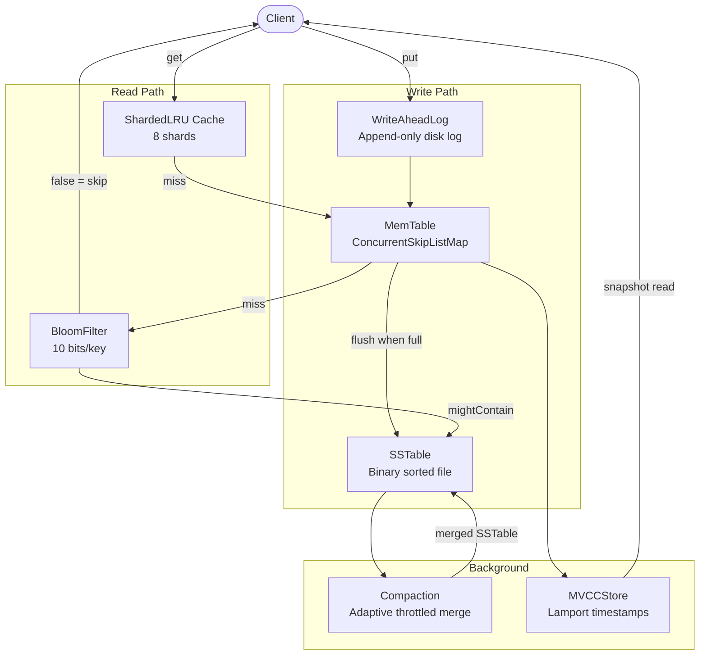

# LSM-Tree Storage Engine with MVCC

A high-performance Log-Structured Merge Tree storage engine built in Java 17, 
designed for write-heavy real-time analytics workloads.

## Benchmark Results
- **117K+ random writes/sec** on commodity hardware (Ryzen 5 5600H, NVMe SSD)
- **p99 write latency: 178µs** under sustained write load
- **~1.0x space amplification** post-compaction via single-level merge strategy
- Tested with 100K operations, 8 concurrent threads

## Architecture

Write Path: Client → WAL → MemTable → SSTable (on flush)
Read Path: Client → LRU Cache → MemTable → BloomFilter → SSTable
Compaction: Background thread merges SSTables, resolves duplicate keys
MVCC: Lamport timestamps enable snapshot isolation for concurrent reads

## Architecture Diagram



## Components

| Component | Description |
|---|---|
| MemTable | In-memory ConcurrentSkipListMap, sorted writes, thread-safe |
| WriteAheadLog | Append-only crash recovery log, cleared after flush |
| SSTable | Binary format sorted on-disk files, flushed from MemTable |
| BloomFilter | 10 bits/key, ~1% false positive rate, skips unnecessary SSTable reads |
| ShardedLRUCache | 8-shard LRU cache, reduces lock contention for concurrent reads |
| Compaction | Adaptive throttled background merge, deduplicates keys across SSTables |
| MVCCStore | Lamport timestamp versioning with snapshot isolation |

## Key Design Decisions

**Why MemTable uses ConcurrentSkipListMap** — sorted order for SSTable flush, 
thread-safe for concurrent writes, O(log n) insert and search

**Why WAL before MemTable** — crash safety, WAL survives power loss, 
replayed on restart to rebuild MemTable

**Why BloomFilter** — eliminates >90% of SSTable reads for missing keys, 
false negatives impossible, false positives acceptable (one extra disk read)

**Why ShardedLRU over single LRU** — 8 independent locks instead of one, 
8 threads contend 8x less, significant throughput improvement

## Running

```bash
# Compile
javac -cp lib/* src/*.java -d out/

# Run benchmark
java -cp out:lib/* Main
```

## Tests
5 JUnit tests covering put/get, missing keys, overwrites, MVCC snapshots, BloomFilter

```bash
# Run tests in IntelliJ — right click LSMEngineTest → Run
```
