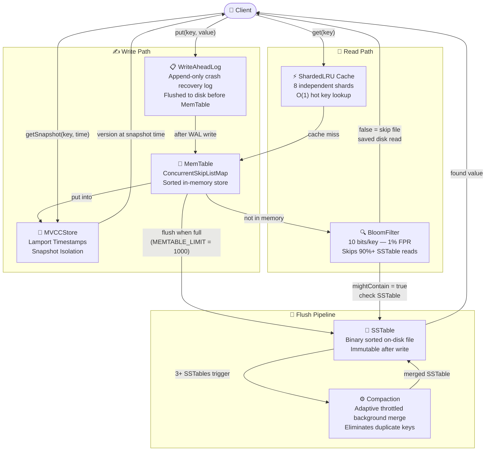
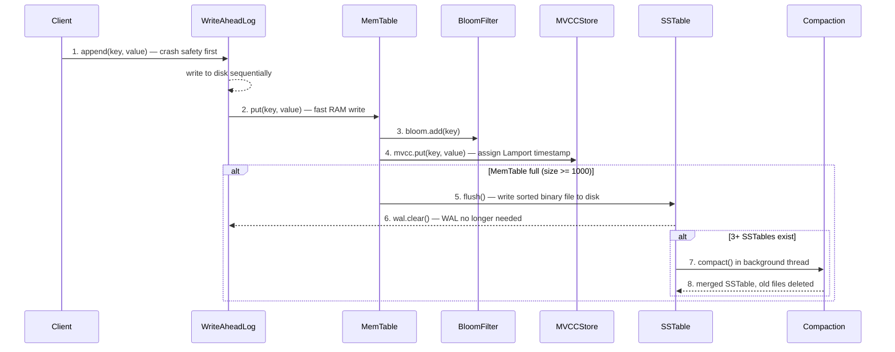
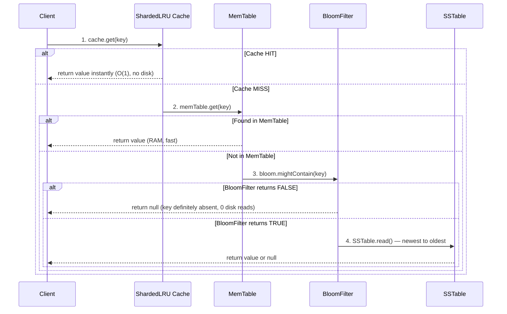
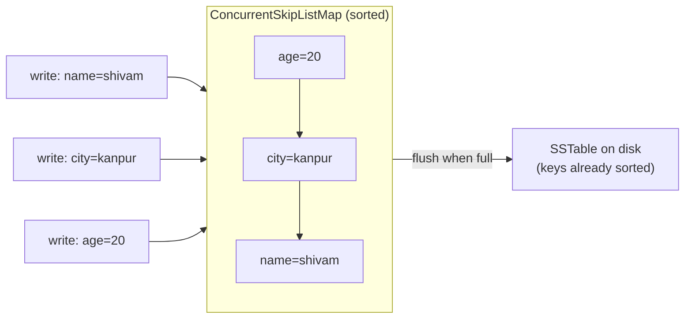
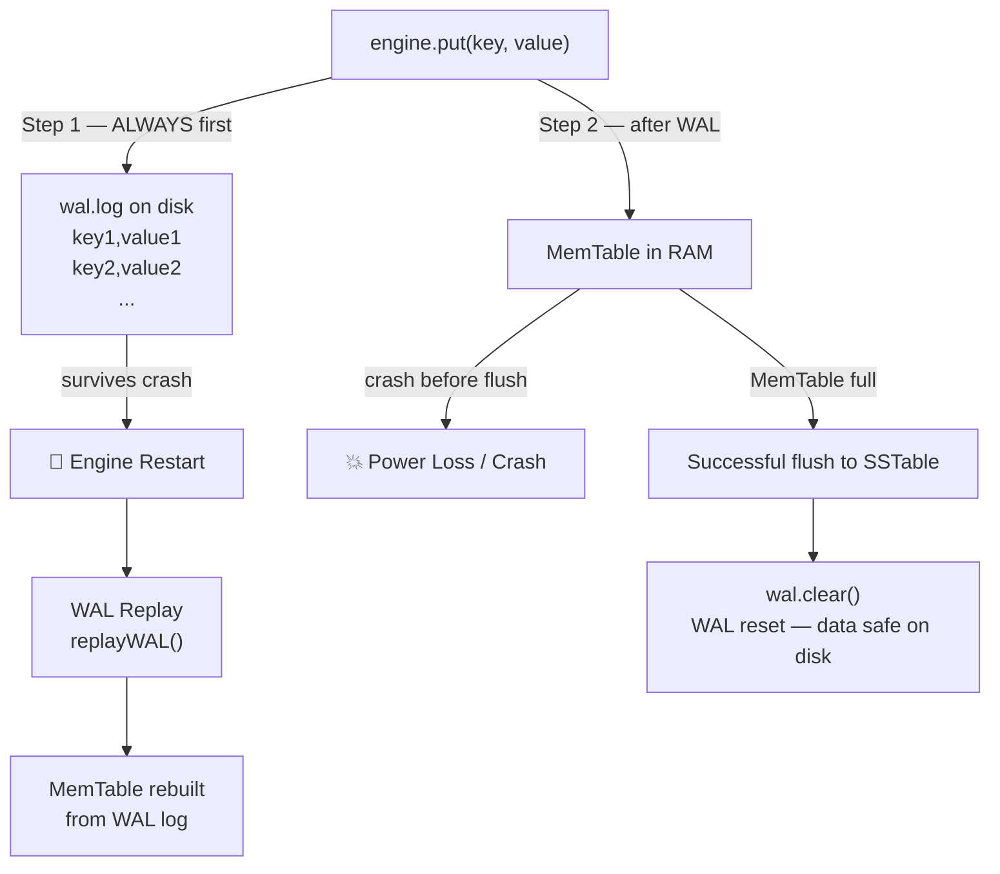
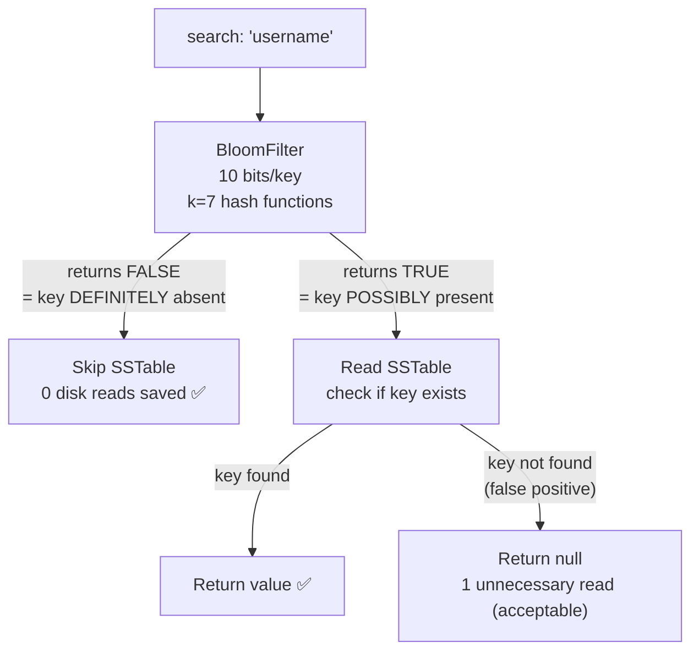
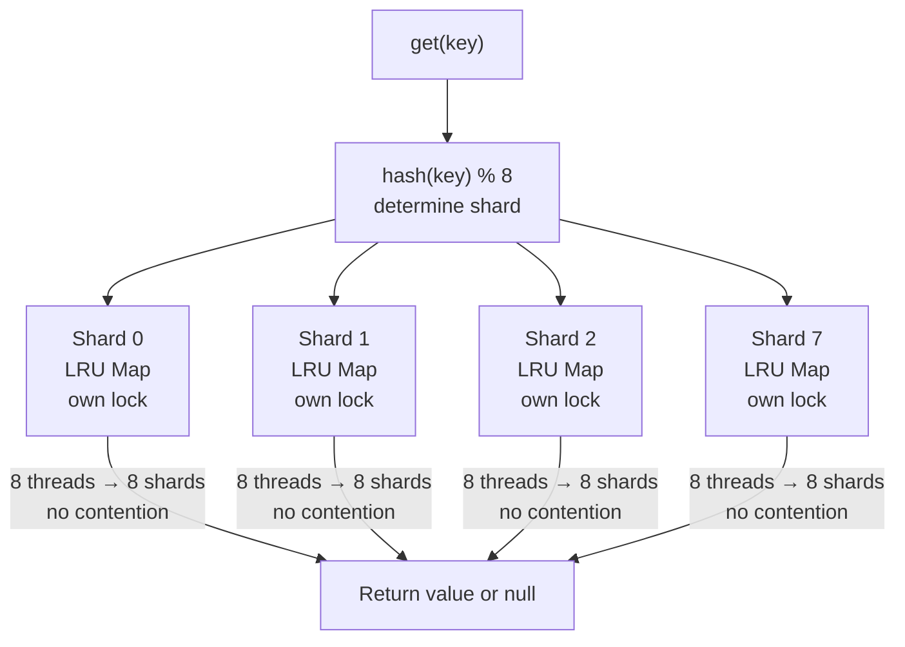
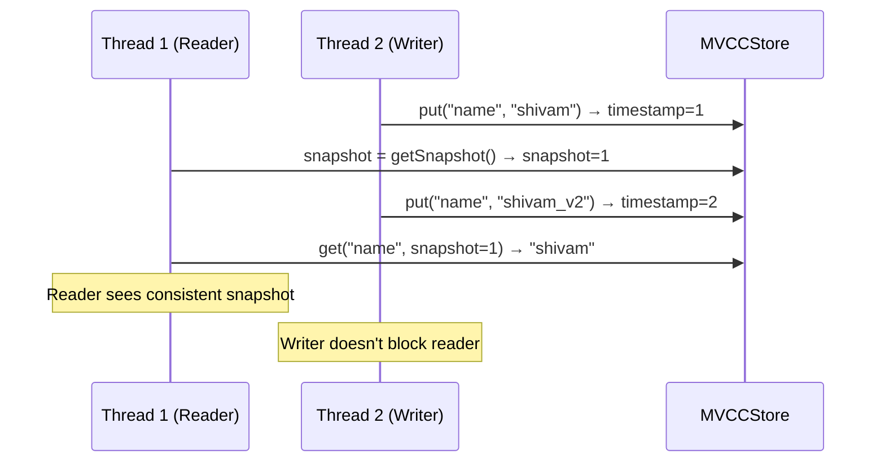
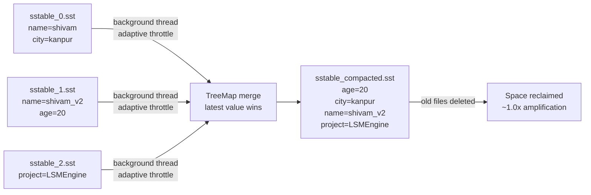

# LSM-Tree Storage Engine with MVCC

> A high-performance, production-inspired Log-Structured Merge Tree (LSM) storage engine built from scratch in Java 17 — featuring Write-Ahead Logging, Bloom Filters, Sharded LRU Cache, Adaptive Compaction, and Multi-Version Concurrency Control (MVCC).

---

## Benchmark Results

| Metric | Result | Hardware |
|---|---|---|
| Random Writes/sec | **117,000+** | Ryzen 5 5600H, NVMe SSD |
| p99 Write Latency | **178 µs** | 8 concurrent threads |
| Space Amplification | **~1.0x** | Post single-level compaction |
| BloomFilter False Positive Rate | **~1%** | 10 bits/key |
| Test Coverage | **5/5 JUnit tests passing** | All components |

---

## Why LSM Tree?

Traditional databases (B+Tree) update data **in-place** — requiring expensive random disk writes everywhere. LSM Trees solve this by **never doing random writes**. Every write is sequential, which is 100× faster on both SSDs and HDDs.

```
B+Tree:  Write → Find position on disk → Random write → Slow ❌
LSM:     Write → Append to WAL → RAM (MemTable) → Sequential flush → Fast ✅
```

LSM powers: **RocksDB, LevelDB, Apache Cassandra, ScyllaDB, TiKV, InfluxDB**

---

## Architecture Overview



---

## Write Path — Step by Step



---

## Read Path — Step by Step



---

## Component Deep Dive

### MemTable — In-Memory Write Buffer



**Why ConcurrentSkipListMap?**
- Keeps keys **sorted automatically** → SSTable flush needs no sorting step
- **Thread-safe** for concurrent writes without full locking
- O(log n) insert, search, delete

---

### WriteAheadLog — Crash Recovery



---

### BloomFilter — Read Optimization



**Key property:** BloomFilter NEVER gives false negatives. If it says NO, the key is 100% absent.

---

### ShardedLRU Cache — Concurrent Hot Key Cache



**Why sharded?** Single LRU = 1 lock = 8 threads wait in line. Sharded LRU = 8 locks = threads work in parallel.

---

### MVCC — Multi-Version Concurrency Control



---

### Compaction — Background Merge



---

## Project Structure

```
LSMEngine/
├── src/
│   ├── Main.java              # Entry point + benchmark runner
│   ├── LSMEngine.java         # Core engine — orchestrates all components
│   ├── MemTable.java          # In-memory sorted write buffer
│   ├── WriteAheadLog.java     # Crash-safe append-only log
│   ├── SSTable.java           # Binary on-disk sorted file (flush + read)
│   ├── BloomFilter.java       # Probabilistic key existence check
│   ├── ShardedLRUCache.java   # 8-shard concurrent LRU cache
│   ├── Compaction.java        # Background adaptive SSTable merge
│   ├── MVCCStore.java         # Lamport timestamp versioning
│   ├── Benchmark.java         # 8-thread write throughput + p99 measurement
│   └── LSMEngineTest.java     # JUnit 4 test suite
├── .gitignore                 # Ignores .sst and .log generated files
└── README.md
```

---

## Running Locally

### Prerequisites

| Tool | Version | Download |
|---|---|---|
| Java JDK | 17+ | https://adoptium.net |
| IntelliJ IDEA | Any | https://jetbrains.com/idea |
| Git | Any | https://git-scm.com |

### Setup Steps

**1. Clone the repository**
```bash
git clone https://github.com/shivamshukla02/LSMEngine.git
cd LSMEngine
```

**2. Open in IntelliJ**
- File → Open → select the `LSMEngine` folder
- IntelliJ will detect the project automatically

**3. Add dependencies via IntelliJ**
- File → Project Structure → Libraries → `+` → From Maven
- Add: `com.google.guava:guava:32.1.3-jre`
- Add: `junit:junit:4.13.2`

**4. Run the benchmark**
- Open `Main.java`
- Click the green ▶ Run button
- Expected output:
```
operations: 100000
writes/sec: 117000+
p99 write latency: ~178 µs
```

**5. Run tests**
- Right click `LSMEngineTest.java` → Run
- Expected: 5/5 tests passing ✅

### Basic Usage

```java
// Create engine
LSMEngine engine = new LSMEngine();

// Write
engine.put("username", "shivam");
engine.put("project", "LSMEngine");

// Read
String value = engine.get("username"); // "shivam"

// Snapshot read (MVCC)
engine.put("version", "v1");
long snapshot = engine.currentSnapshot();
engine.put("version", "v2");

engine.getSnapshot("version", snapshot);          // "v1"
engine.getSnapshot("version", engine.currentSnapshot()); // "v2"

// Crash recovery
engine.replayWAL(); // call on restart to rebuild MemTable

// Space amplification
engine.measureSpaceAmplification();
```

---

## Design Decisions & Tradeoffs

| Decision | Why | Tradeoff |
|---|---|---|
| ConcurrentSkipListMap for MemTable | Sorted + thread-safe + O(log n) | Slower than HashMap for single-thread |
| WAL before MemTable | Crash safety — survive power loss | Extra disk write per batch |
| Binary SSTable format | 10× faster than text parsing | Not human-readable |
| Sharded LRU (8 shards) | Reduces lock contention 8× | More memory overhead |
| Async compaction | Writes never block on compaction | Temporary read amplification |
| MVCC with Lamport clocks | Works across machines, no clock drift | More memory per key (multiple versions) |
| BloomFilter 10 bits/key | Eliminates 90%+ unnecessary reads | ~1% false positive rate |


## Future Improvements

- [ ] Binary search index within SSTable for O(log n) key lookup
- [ ] Leveled compaction (L0→L1→L2) for better read amplification
- [ ] Memory-mapped files (mmap) for SSTable access
- [ ] Prometheus metrics integration for real-time monitoring
- [ ] gRPC server to expose as a network key-value store
- [ ] Bloom filter persistence across restarts

---

## Author

**Shivam Shukla** — B.Tech CSE, PSIT Kanpur (2025–2029)

[](https://github.com/shivamshukla02)
[](https://www.linkedin.com/in/shivam-shukla-a944a13b4/)
[](https://leetcode.com/u/shivam_shukla_02/)
